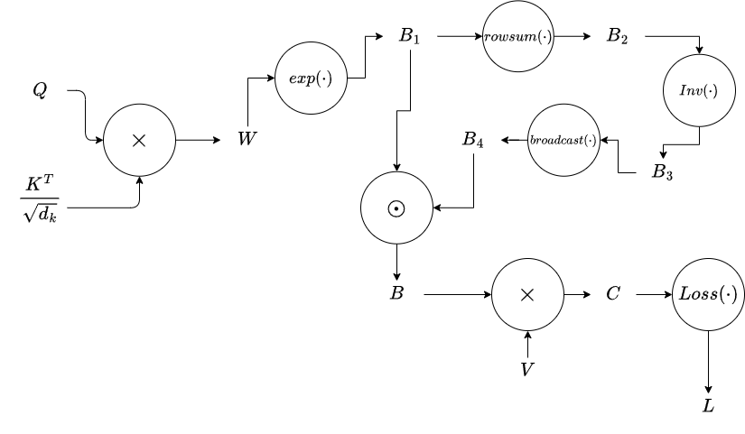

## Table of contents


## Introduction


In this post, I will be manually deriving the gradients of the keys, queries, and values (K, Q, V) of the standard attention formula, assuming a downstream scalar objective function. This is a fun exercise to practice the basics of backpropagation and often appears in AI-related interviews. I highly recommend carefully reading through the preliminaries and attempting the derivation yourself. 


## Preliminaries


This section is meant to be a quick refresher and assumes prior knowledge of backpropagation, so if this is your first time manually backpropagating with tensors, check out Karpathy's videos on backpropagation beforehand. 


To write out the gradients, I will be adhering to the denominator-layout convention. For the purposes of backpropagation, all this means is that gradients of variables will have the same shape as them, since the trailing output is always a scalar. 


$$


\frac{\partial y}{\partial \mathbf{x}} =


\begin{bmatrix}


\frac{\partial y}{\partial x_1} \\


\frac{\partial y}{\partial x_2} \\


\vdots \\


\frac{\partial y}{\partial x_n}


\end{bmatrix}


$$


$$


\frac{\partial y}{\partial \mathbf{X}} =


\begin{bmatrix}


\frac{\partial y}{\partial X_{11}} & \frac{\partial y}{\partial X_{12}} & \cdots & \frac{\partial y}{\partial X_{1m}} \\


\frac{\partial y}{\partial X_{21}} & \frac{\partial y}{\partial X_{22}} & \cdots & \frac{\partial y}{\partial X_{2m}} \\


\vdots & \vdots & \ddots & \vdots \\


\frac{\partial y}{\partial X_{n1}} & \frac{\partial y}{\partial X_{n2}} & \cdots & \frac{\partial y}{\partial X_{nm}}


\end{bmatrix}


$$


Having a scalar output leads to some neat tricks through the chain rule, which allow us to avoid dealing with tensor gradients of more than two dimensions. I will list concepts through examples that are important to know for backpropagating through attention. For all of these examples, I will assume a trailing scalar output $L$.


Let $Y_1 = WX_1$, $Y_2 = X_2W$, and $Z = Y_1 + Y_2$, where $W \in \mathbb{R}^{n \times m}$ and $X_1,X_2 \in \mathbb{R}^{m \times n}$.


1) $\frac{\partial L}{\partial W}$ = $\frac{\partial Y_1}{\partial W} \frac{\partial Z}{\partial Y_1} \frac{\partial L}{\partial Z} + \frac{\partial Y_2}{\partial W} \frac{\partial Z}{\partial Y_2} \frac{\partial L}{\partial Z}$  (chain rule)


2) $\frac{\partial L}{\partial X_1} = W^T \frac{\partial L}{\partial Y_1}$ (matrix/vector multiplication)


3) $\frac{\partial L}{\partial X_2} = \frac{\partial L}{\partial Y_2} W^T$ (matrix/vector multiplication)


4) $\frac{\partial L}{\partial X_2^T} = W (\frac{\partial L}{\partial Y_2})^T$ (transpose operation)


In PyTorch, it is well known that broadcasting will lead to your gradients getting summed, and summing will lead to your gradients getting broadcasted. This is, of course, mathematically true as well and can be shown using 3. above. 


Assume $\bold{x} \in \mathbb{R}^{n \times 1}$ is a column vector, $X \in \mathbb{R}^{n \times m}$, and $\bold{1_m} \in \mathbb{R}^{m \times 1}$ is a column vector filled with ones. Let $y_1 = X\bold{1_m}$ and $y_2 = \bold{x}\bold{1_m}^T$. Notice that $y_1$ is equivalent to a summing rows operation and $y_2$ is equivalent to broadcasting $\bold{x}$ to an $n \times m$ matrix. 


5) $ \frac{\partial L}{\partial X} = \frac{\partial L}{\partial y_1}\bold{1_m}^T $ (broadcasting trailing gradients)


6) $ \frac{\partial L}{\partial x}  = \frac{\partial L}{\partial y_2} \bold{1_m} $ (row summing trailing gradients)


The last bit of necessary information is knowing how to backpropegate through element wise operations such as element wise matrix multiplication. You can think of this as individually differentiating every scalar $Y_{ij}$ with respect to $X_{ij}$. Let X and W be matrices of the same dimension and let $Y = X \odot W$. 


7) $ \frac{\partial L}{\partial X} =  \frac{\partial L}{\partial Y} \odot W $ (similar result for $ \frac{\partial L}{\partial W}$)


## Manual Attention Backpropagation


The attention mechanism is the backbone of the Transformer architecture. It takes keys, queries, and values (K, Q, V) as inputs and computes:


$$


\begin{align*} Attention(K, Q, V) = softmax(\frac{QK^T}{\sqrt{d_k}})V \end{align*} 


$$


### Derivation


I will be computing the gradients of a scalar output $L$ with respect to $K$, $Q$, and $V$, all elements of $\mathbb{R}^{n \times h}$. Let's define a few variables.


$$ 


\begin{align*}


W &= \frac{QK^T}{\sqrt{d_k}} \in \mathbb{R}^{n \times n} \\

B &= softmax(W) \in \mathbb{R}^{n \times n} \\

C &= BV \in \mathbb{R}^{n \times h} 


\end{align*}


$$


Note that Attention(K, Q, V) = C. Also, for the purposes of this example, we will simply call all computations following the attention mechanism $ Loss(\cdot) $, which outputs a scalar value. Before we jump in, we also need to determine how to backpropagate through the softmax function. 


$$


\begin{pmatrix}

  z_1 & z_2 & \dots & z_K

\end{pmatrix}

\quad \xrightarrow{\text{softmax}} \quad

\begin{pmatrix}

  \frac{e^{z_1}}{\sum_{j=1}^{K} e^{z_j}} &

  \frac{e^{z_2}}{\sum_{j=1}^{K} e^{z_j}} &

  \dots &

  \frac{e^{z_K}}{\sum_{j=1}^{K} e^{z_j}}

\end{pmatrix}


$$


In Attention, softmax is applied to rows of the input matrix, so we need to be a little creative in how we represent the softmax function. The formulation I came up with is the following:


$$ 


\begin{align*} 


B &= softmax(W) \\

  &= exp(W) \odot ((exp(W)\bold{1_n})^{-1}\bold{1_n^T}) \\

  & = B_1 \odot ((B_2)^{-1}\bold{1_n^T}) \\

  & = B_1 \odot (B_3\bold{1_n^T}) \\

  & = B_1 \odot B_4


\end{align*} 


$$ 


Where $B_1 = exp(W)$, $B_2 = B_1\bold{1_n}$, $B_3 = B_2^{-1}$, and $B_4 = B_3\bold{1_n^T}$. You can imagine this as breaking up softmax into five distinct operations: exponentiating the input matrix, summing up the rows of the exponentiated matrix, taking the multiplicative inverse to get the normalization factor, broadcasting back to the shape of the original matrix, and multiplying element wise. The following computational graph shows all the variables defined and how they interact. 





Now, we have all the necessary pieces to begin!


- $ \frac{\partial L}{\partial V} = B^T \frac{\partial L}{\partial C} = \zeta_1 \in \mathbb{R}^{n \times h}$

- $ \frac{\partial L}{\partial B} = \zeta_1 V^T = \zeta_2 \in \mathbb{R}^{n \times n} $

- $ \frac{\partial L}{\partial B_4} = B_1 \odot \zeta_2 = \zeta_3 \in \mathbb{R}^{n \times n} $

- $ \frac{\partial L}{\partial B_3} = \zeta_3\bold{1_n} = \zeta_4 \in \mathbb{R}^{n \times 1} $

- $ \frac{\partial L}{\partial B_2} = -(B_2 \odot B_2)^{-1} \odot \zeta_4 = \zeta_5 \in \mathbb{R}^{n \times 1} $


Notice the two paths to $B_1$. This means the gradients need to be accumulated. 


- $ \frac{\partial L}{\partial B_1} = \zeta_5\bold{1_n^T} +  \zeta_3 \odot B_4 = \zeta_6 \in \mathbb{R}^{n \times n} $

- $ \frac{\partial L}{\partial W} = B_1 \odot \zeta_6 = \zeta_7 \in \mathbb{R}^{n \times n} $

- $ \frac{\partial L}{\partial Q} = \zeta_7\frac{K}{\sqrt{d_k}} \in \mathbb{R}^{n \times h} $

- $ \frac{\partial L}{\partial K} = \zeta_7^T \frac{Q}{\sqrt{d_k}} \in \mathbb{R}^{n \times h} $


### Code Verification


The following code defines all the variables we discussed above. As a sanity check, I verify that attention is being calculated properly.  I created an arbitrary scalar output by simply summing, but any differentiable operation that produces a scalar would work.


```python

import torch
import torch.nn as nn
import torch.nn.functional as F

Ones = torch.ones((10, 1))

Q = torch.randn(10, 20, requires_grad = True)
K = torch.randn(10, 20, requires_grad=True)
V = torch.randn(10, 20, requires_grad=True)
d_k = K.shape[-1]**(0.5)

W = Q @ K.T * (d_k**-1) # (10, 10)
B1 = torch.exp(W) # (10, 10)
B2 = B1.sum(dim = -1, keepdim = True) # (10, 1)
B3 = (B2)**-1 # (10,1)
B4 = B3 @ Ones.T # (10, 10)
# B = B1 * B3
B = B1 * B4 # (10, 10)
C = B @ V

W.retain_grad()
B1.retain_grad()
B2.retain_grad()
B3.retain_grad()
B4.retain_grad()
B.retain_grad()
C.retain_grad()

L = C.sum() # scalar output, could be anything.

# Sanity check
Attn = F.scaled_dot_product_attention(Q, K, V)
is_close = torch.allclose(Attn, C, atol = 1e-6)
print(f"C is within floating point error to output of standard attention: {is_close}")
```

```
>> C is within floating point error to output of standard attention: True
```


Now, we just need to replicate the derivations with code. I commented above gradients that had summing or broadcasting to show how you would normally see them in PyTorch.


```python
grad_C = C.grad # trailing gradient
grad_V = B.T @ grad_C
grad_B = grad_C @ V.T
grad_B4 = B1 * grad_B
# grad_B3 = grad_B4.sum(-1, keepdim=True)
grad_B3 = grad_B4 @ Ones
grad_B2 = -((B2 * B2)**-1) * grad_B3
# grad_B1 = grad_B2 + grad_B * B4
grad_B1 = grad_B2 @ Ones.T + grad_B * B4
grad_W = B1 * grad_B1
grad_Q = grad_W @ K * (d_k**-1)
grad_K = grad_W.T @ Q * (d_k**-1)
```


Finally, the results where we compare the gradients in PyTorch with our manual derivations:


```python
print("Comparing gradients:")

is_close_V = torch.allclose(grad_V, V.grad, atol=1e-6)
diff_V = torch.abs(grad_V - V.grad).mean()
print(f"grad_V is close: {is_close_V}, mean difference: {diff_V.item()}")

is_close_B = torch.allclose(grad_B, B.grad, atol=1e-6)
diff_B = torch.abs(grad_B - B.grad).mean()
print(f"grad_B is close: {is_close_B}, mean difference: {diff_B.item()}")

#comment out if you want to check pytorchified code
is_close_B4 = torch.allclose(grad_B4, B4.grad, atol=1e-6)
diff_B4 = torch.abs(grad_B4 - B4.grad).mean()
print(f"grad_B4 is close: {is_close_B4}, mean difference: {diff_B4.item()}")

is_close_B3 = torch.allclose(grad_B3, B3.grad, atol=1e-6)
diff_B3 = torch.abs(grad_B3 - B3.grad).mean()
print(f"grad_B3 is close: {is_close_B3}, mean difference: {diff_B3.item()}")

is_close_B2 = torch.allclose(grad_B2, B2.grad, atol=1e-6)
diff_B2 = torch.abs(grad_B2 - B2.grad).mean()
print(f"grad_B2 is close: {is_close_B2}, mean difference: {diff_B2.item()}")

is_close_B1 = torch.allclose(grad_B1, B1.grad, atol=1e-6)
diff_B1 = torch.abs(grad_B1 - B1.grad).mean()
print(f"grad_B1 is close: {is_close_B1}, mean difference: {diff_B1.item()}")

is_close_W = torch.allclose(grad_W, W.grad, atol=1e-6)
diff_W = torch.abs(grad_W - W.grad).mean()
print(f"grad_W is close: {is_close_W}, mean difference: {diff_W.item()}")

is_close_Q = torch.allclose(grad_Q, Q.grad, atol=1e-6)
diff_Q = torch.abs(grad_Q - Q.grad).mean()
print(f"grad_Q is close: {is_close_Q}, mean difference: {diff_Q.item()}")

is_close_K = torch.allclose(grad_K, K.grad, atol=1e-6)
diff_K = torch.abs(grad_K - K.grad).mean()
print(f"grad_K is close: {is_close_K}, mean difference: {diff_K.item()}")
```


```
>> Comparing gradients:
>> grad_V is close: True, mean difference: 0.0
>> grad_B is close: True, mean difference: 0.0
>> grad_B4 is close: True, mean difference: 0.0
>> grad_B3 is close: True, mean difference: 0.0
>> grad_B2 is close: True, mean difference: 0.0
>> grad_B1 is close: True, mean difference: 0.0
>> grad_W is close: True, mean difference: 0.0
>> grad_Q is close: True, mean difference: 1.5301630185149406e-08
>> grad_K is close: True, mean difference: 1.6916310130454804e-08
```


As can be seen, the results are nearly identical to the gradients in PyTorch, with the differences being only floating precision errors. 


## Conclusion


I introduced a few concepts needed to backpropagate through attention. Then, I manually derived the gradients for each component of the attention computational graph. Lastly, I verified the correctness of the derivations through code. I hope you found this helpful/interesting, and thank you for reading!


