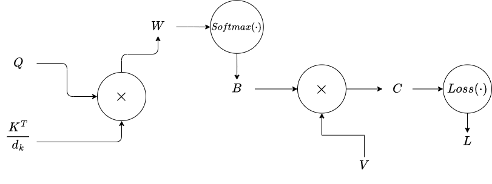

## Table of contents

## Introduction

In this post, I will be manually deriving the gradients of the keys, queries, and values (K, Q, V) of the standard attention formula, assuming a downstream scalar objective function. This is a fun exercise to practice backpropagation basics and often appears in AI research interviews. I highly recommend carefully reading through the preliminaries and attempting the derivation yourself. 

## Preliminaries

This section is meant to be a quick refresher and assumes prior knowledge of backpropegation, so if this is your first time manually backpropegating with tensors, check out Karpathy's videos on backpropegation beforehand. 

To write out the gradients, I will be adhering to the denominator-layout convention. For the purposes of backpropagation, all this means is that gradients of variables will have the same shape as them, since the trailing output is always a scalar. 

$$

\frac{\partial y}{\partial \mathbf{x}} =

\begin{bmatrix}

\frac{\partial y}{\partial x_1} \\

\frac{\partial y}{\partial x_2} \\

\vdots \\

\frac{\partial y}{\partial x_n}

\end{bmatrix}

$$

$$

\frac{\partial y}{\partial \mathbf{X}} =

\begin{bmatrix}

\frac{\partial y}{\partial X_{11}} & \frac{\partial y}{\partial X_{12}} & \cdots & \frac{\partial y}{\partial X_{1m}} \\

\frac{\partial y}{\partial X_{21}} & \frac{\partial y}{\partial X_{22}} & \cdots & \frac{\partial y}{\partial X_{2m}} \\

\vdots & \vdots & \ddots & \vdots \\

\frac{\partial y}{\partial X_{n1}} & \frac{\partial y}{\partial X_{n2}} & \cdots & \frac{\partial y}{\partial X_{nm}}

\end{bmatrix}

$$

Having a scalar output leads to some neat tricks through the chain rule, which allow us to avoid dealing with tensor gradients of more than two dimensions. I will list concepts through examples that are important to know for backpropagating through attention. For all of these examples, I will assume a trailing scalar output $L$.

$Y_1 = WX_1$, $Y_2 = X_2W$, and $Z = Y_1 + Y_2$ where $W \in \mathbb{R}^{n \times m}$ and $X_1,X_2 \in \mathbb{R}^{m \times n}$.

1) $\frac{\partial L}{\partial W}$ = $\frac{\partial Y_1}{\partial W} \frac{\partial Z}{\partial Y_1} \frac{\partial L}{\partial Z} + \frac{\partial Y_2}{\partial W} \frac{\partial Z}{\partial Y_2} \frac{\partial L}{\partial Z}$  (chain rule)

2) $\frac{\partial L}{\partial X_1} = W^T \frac{\partial L}{\partial Y_1}$ (matrix/vector multiplication)

3) $\frac{\partial L}{\partial X_2} = \frac{\partial L}{\partial Y_2} W^T$ (matrix/vector multiplication)

In PyTorch, it is well known that broadcasting will lead to your gradients getting summed and summing will lead to your gradients getting broadcasted. This is, of course, mathmatically true as well and can be shown using 3. above. 

Assume $\bold{x} \in \mathbb{R}^{n \times 1}$ is a column vector, $X \in \mathbb{R}^{n \times m}$, and $\bold{1_m} \in \mathbb{R}^{m \times 1}$ is a column vector filled with ones. Let $y_1 = X\bold{1_m}$ and $y_2 = \bold{x}\bold{1_m}^T$. Notice that $y_1$ is equivalent to a summing rows operation and $y_2$ is equivalent to broadcasting $\bold{x}$ to an $n \times m$ matrix. 

4) $ \frac{\partial L}{\partial X} = \frac{\partial L}{\partial y_1}\bold{1_m}^T $ (broadcasting trailing gradients)

5) $ \frac{\partial L}{\partial x}  = \frac{\partial L}{\partial y_2} \bold{1_m} $ (row summing trailing gradients)

The last bit of necessary information is knowing how to backpropegate through element wise matrix multiplication. Let X and W be matrices of the same dimension and let $Y = X \odot W$.

6) $ \frac{\partial L}{\partial X} =  \frac{\partial L}{\partial Y} \odot W $ (similar result for $ \frac{\partial L}{\partial W}$)

## Manual Attention Backpropegation

The attention mechanism is the backbone of the Transformer architecture. It takes keys, queries, and values (K, Q, V) as inputs and computes:

$$

\begin{align*} Attention(K, Q, V) = Softmax(\frac{QK^T}{d_k})V \end{align*} 

$$

I will be computing the gradients of a scalar output $L$ with respect to $K$, $Q$, and $V$ all elements of $\mathbb{R}^{n \times h}$. But before we jump in to the derivation, let's define a few variables.

- $ W = \frac{QK^T}{d_k} \in \mathbb{R}^{n \times n} $
- $ B = Softmax(W) \in \mathbb{R}^{n \times n}$
- $ C = BV \in \mathbb{R}^{n \times h}$ 

Note that Attention(K, Q, V) = C. Also, for the purposes of this example we will simply call all computation following the attention mechanism $ Loss(\cdot) $, which outputs a scalar value. The following computational graph provides a visual of the variables and how they interact.  

Now, we can begin the derivation starting with $\frac{\partial L}{\partial V}$.

- $ \frac{\partial L}{\partial V} = B^T \frac{\partial L}{\partial C} = \zeta_1 \in \mathbb{R}^{n \times h}$
- $ \frac{\partial L}{\partial B} = \zeta_1 V^T = \zeta_2 \in \mathbb{R}^{n \times n} $

